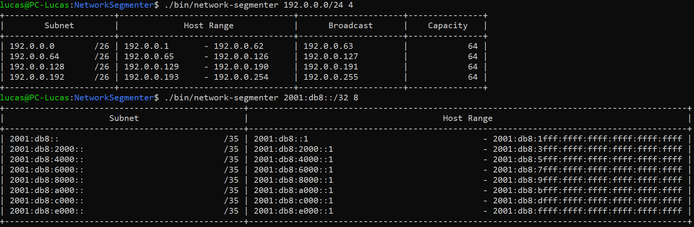

# Network Segmenter

[](https://github.com/SIIR3X/network-segmenter/blob/main/LICENSE)



A simple tool for segmenting IPv4 and IPv6 networks into smaller subnets based on user-defined parameters.

## Description

**Network Segmenter** is a command-line tool designed to facilitate network management by **segmenting** both **IPv4** and **IPv6** networks into **subnets**. This tool supports **IP address** input with **CIDR** notation and allows users to define the number of subnets they want to generate. It automatically handles the necessary calculations and provides subnet details for easier network management and organization.

This project is compatible with both **Linux** and **Windows** operating systems and is developed using **C++ 14**. Full documentation can be found in the [docs](docs) directory. It is available under the **MIT License**.

## Installation

### Requirements

- **Operating System**:
    - *Linux* or *Windows*.
- **Compiler**: 
    - *g++* compiler with C++ 14 support.
- **Build tools**: 
    - *make* for Linux and *mingw32-make* for Windows.

### Development Dependencies

- **Document Generator**: *Doxygen* for generating documentation.
- **Memory check tool**: *valgrind* for memory leak detection.
- **Testing framework**: *googletest* for unit testing.

### Build

1. **Clone the repository**:

```bash
git clone https://github.com/SIIR3X/network-segmenter.git
cd network-segmenter
```

2. **Compile the project**:

- **Linux**:
```bash
make
```

- **Windows (requires mingw32-make)**:
```bash
mingw32-make
```

## Usage

### Command Line Arguments

The program accepts the following command-line arguments:

- **argv[1]**: IP address with CIDR notation.
- **argv[2]**: Number of subnets to generate.

### Examples

```bash
# Linux
./bin/network-segmenter 192.0.0.0/24 4

# Windows
bin\network-segmenter 192.0.0.0/24 4
```

```bash
# Linux
./bin/network-segmenter 2001:db8::/32 8

# Windows
bin\network-segmenter 2001:db8::/32 8
```

### Output

The program will output in the terminal the following information for each subnet generated:

- **Subnet ip and prefix**: The IP address and prefix of the subnet.
- **Host range**: The range of host IP addresses in the subnet.
- **Broadcast address (IPv4 only)**: The broadcast address of the subnet.
- **Capacity (IPv4 only)**: The number of usable IP addresses in the subnet.


## Makefile Commands

The following commands are available in the Makefile:

- **make**: Compiles the project.
- **make run**: Runs the program.
- **make test**: Runs the unit tests (requires googletest).
- **make memorycheck**: Checks for memory leaks using valgrind (only available on Linux).
- **make memorychecktest**: Checks for memory leaks in the unit tests using valgrind (only available on Linux).
- **make clean**: Removes the compiled object files.
- **make delete**: Removes the main executable.
- **make deletetest**: Removes the test executable.
- **make cleanall**: Removes all compiled files.
- **make docs**: Generates the documentation using Doxygen.

*For Windows*, use `mingw32-make` instead of `make`.

## License

This project is licensed under the **MIT License**. For more information, see the [LICENSE](LICENSE) file.